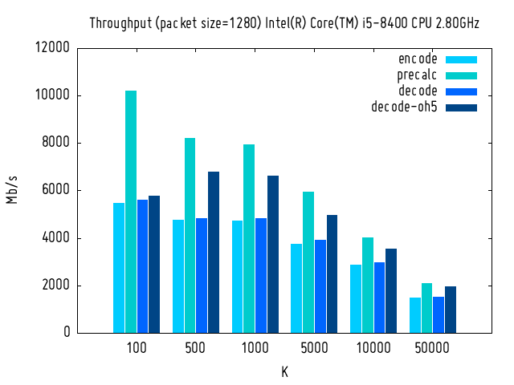

# nanorq
nanorq is a compact, performant implementation of the raptorq fountain code capable of reaching multi-gigabit speeds on a single core.

nanorq provides flexible I/O handling, wrappers are provided for memory buffers, mmap (zero copy) and streams. Additional abstractions can be implemented without interacting with the decoder logic.

# Performance

# Use cases
- firmware deployment / software updates
- video streaming
- large data transfers across high latency links

