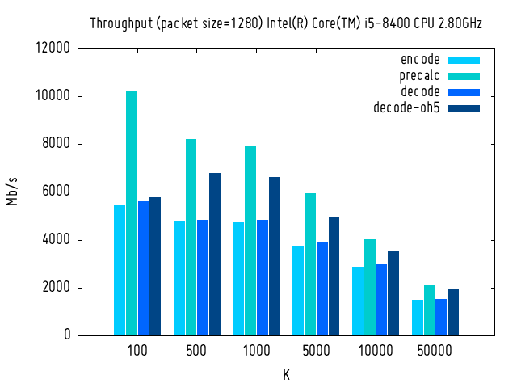

# nanorq

nanorq is a compact, performant implementation of the raptorq fountain code capable of reaching multi-gigabit speeds on a single core.

## API
  - High-level API `nanorq.h` abstracts allocation, alignment, and I/O handling from the user.
  - Low-level API `nanorq_core.h` provides more flexibility and can be used without any libc dependency[^1], but requires more integration from the user.

## Performance[^2]

## Use cases
  - firmware deployment / software updates
  - video streaming
  - large data transfers across high latency links

## Helper Modules

### Tunable Sparse Network Coding (TSNC)
A helper module under `tsnc/` that implements block-based and sliding window network coding, leveraging the optimized primitives used for `nanorq`.

Some examples are provided:
  - Blockchain gossip propagation: Accelerating block synchronization across peer-to-peer gossip networks.
  - Multipath recoding: Re-encoding packets at intermediate network hops without full block decoding to maximize throughput.
  - Real-time continuous streaming: Utilizing a sliding window mechanism to recover missing stream data with minimal overhead and latency.

[^1]: When compiled with `NDEBUG`. Test suite requires stdlib.
[^2]: Build autodetects and optimizes for the host CPU architecture (using -march=native).
